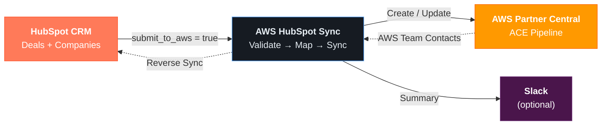

# HubSpot → AWS Pipeline Sync

<p align="center">
  <strong>Sync HubSpot CRM deals to AWS Partner Central (ACE) automatically.</strong><br>
  Built for AWS Partner Network members who use HubSpot as their CRM.
</p>

<p align="center">
  <a href="#quick-start"></a>
  <a href="LICENSE"></a>
  <a href="#running-on-a-schedule"></a>
  <a href="#slack-notifications-optional"></a>
</p>

---

## Get Started in 3 Steps

```bash
# 1. Clone and install
git clone https://github.com/georgegray22/hubspot-aws-pipeline-sync.git
cd hubspot-aws-pipeline-sync
pip install -e ".[dev]"

# 2. Set up your config (pick one)
```

### Option A: Let Claude Code walk you through it (Recommended)

If you have [Claude Code](https://claude.ai/code) installed, paste this prompt in the project directory:

> **Help me set up this project. Read the CLAUDE.md setup guide, .env.example, and README, then walk me through configuring everything step by step.**

Claude will ask you for each credential one at a time, help you map your HubSpot stages to ACE stages, and write your `.env` file automatically.

### Option B: Manual setup

```bash
cp .env.example .env
# Edit .env with your credentials and stage mappings
# See the Configuration Guide below for details
```

### 3. Run

```bash
python -m src.main test-connection   # Verify AWS credentials
python -m src.main sync --dry-run    # Preview (no writes)
python -m src.main sync --catalog AWS # Sync for real
```

---

## What You'll Need

Before you start, make sure you have:

- **Python 3.11+**
- **AWS Partner Network membership** with [ACE API access](https://aws.amazon.com/partners/)
- **HubSpot account** with admin access (to create a Private App + custom properties)
- **AWS IAM credentials** with `partnercentral-selling` permissions ([setup guide below](#1-aws-iam-setup))

---

## Features

| | Feature | Description |
|---|---------|-------------|
| :arrows_counterclockwise: | **Bi-directional sync** | Deals flow HubSpot → ACE, AWS team contacts flow ACE → HubSpot |
| :world_map: | **Stage mapping** | Maps your custom HubSpot stages to ACE pipeline stages |
| :wastebasket: | **Withdrawal handling** | Unchecking "Submit to AWS" automatically closes the ACE opportunity |
| :bell: | **Slack notifications** | Optional rich summaries with per-deal detail threads |
| :test_tube: | **Dry run mode** | Preview everything without writing to ACE or HubSpot |
| :shield: | **Idempotent** | Safe to run repeatedly — deterministic tokens and change detection |
| :lock: | **Field locking** | Respects AWS-approved field locks and stage regression rules |

## How It Works



**The sync flow for each deal:**

```
 1. Fetch deals where submit_to_aws = true
 2. NEW deals (no ACE ID) → Validate → Create → Associate → Submit for AWS review
 3. EXISTING deals (has ACE ID) → Detect changes → Update stage/amount/close date
 4. OPTED-OUT deals (unchecked) → Close ACE opportunity → Clear sync fields
 5. Reverse sync → Pull AWS Account Manager, Sales Rep, PSM, PDM into HubSpot
```

If anything is misconfigured, you'll get clear error messages telling you exactly what to fix:

```
 ❌  Configuration errors found:
  • STAGE_MAPPING is not set. You must map your HubSpot stage IDs to ACE stages.
    Example: STAGE_MAPPING="qualified=Qualified;eval=Technical Validation;closedlost=Closed Lost"
  • ACE_SOLUTION_ID is not set. Find your solution ID in AWS Partner Central.

 ℹ️  Fix the above in your .env file. See .env.example for instructions.
```

---

## Configuration Guide

<details>
<summary><h3>1. AWS IAM Setup</h3></summary>

Create an IAM user with the following policy:

```json
{
  "Version": "2012-10-17",
  "Statement": [
    {
      "Effect": "Allow",
      "Action": [
        "partnercentral-selling:GetOpportunity",
        "partnercentral-selling:GetAwsOpportunitySummary",
        "partnercentral-selling:ListOpportunities",
        "partnercentral-selling:ListSolutions",
        "partnercentral-selling:CreateOpportunity",
        "partnercentral-selling:UpdateOpportunity",
        "partnercentral-selling:AssociateOpportunity",
        "partnercentral-selling:StartEngagementFromOpportunityTask"
      ],
      "Resource": "*"
    }
  ]
}
```

Set `AWS_ACE_ACCESS_KEY_ID` and `AWS_ACE_SECRET_ACCESS_KEY` in your `.env`.

</details>

<details>
<summary><h3>2. HubSpot Setup</h3></summary>

#### Create a Private App

1. Go to **Settings → Integrations → Private Apps**
2. Create a new app with these scopes:
   - `crm.objects.deals.read`
   - `crm.objects.deals.write`
   - `crm.objects.companies.read`
   - `crm.objects.contacts.read`
   - `crm.schemas.deals.read`
3. Copy the access token to `HUBSPOT_API_KEY`

#### Create Custom Deal Properties

You need to create these custom properties on your Deal object:

| Property | Internal Name | Type |
|----------|--------------|------|
| Submit to AWS | `submit_to_aws` | Checkbox |
| ACE Opportunity ID | `ace_opportunity_id` | Single-line text |
| ACE Sync Status | `ace_sync_status` | Dropdown* |
| ACE Last Sync | `ace_last_sync` | Date/time |
| ACE Sync Error | `ace_sync_error` | Multi-line text |
| ACE Project Description | `ace_project_description` | Multi-line text |
| AWS Account Manager | `ace_aws_account_manager` | Single-line text |
| AWS Account Manager Email | `ace_aws_account_manager_email` | Single-line text |
| AWS Sales Rep | `ace_aws_sales_rep` | Single-line text |
| AWS Sales Rep Email | `ace_aws_sales_rep_email` | Single-line text |
| AWS Partner Sales Manager | `ace_aws_partner_sales_manager` | Single-line text |
| AWS Partner Dev Manager | `ace_aws_partner_development_manager` | Single-line text |

*Dropdown values: `not_synced`, `pending_review`, `Synced`, `Sync Error`, `Rejected`

> **Tip:** If your HubSpot uses different internal names, override them via `HS_*` environment variables. See `.env.example`.

</details>

<details>
<summary><h3>3. Stage Mapping ⚡ (Most Important)</h3></summary>

You need to map YOUR HubSpot deal stage IDs to the ACE pipeline stages.

**Find your stage IDs:** Go to HubSpot Settings → Deals → Pipelines → click on your pipeline. Stage IDs appear in the URL or via the API: `GET /crm/v3/pipelines/deals/{pipelineId}/stages`.

**Set the mapping in `.env`:**

```bash
# Format: hubspot_stage_id=ACE Stage Name (semicolon-separated)
STAGE_MAPPING="qualified=Qualified;technical_eval=Technical Validation;business_val=Business Validation;negotiation=Committed;closed_won=Launched;closedlost=Closed Lost"

# Human-readable display names (for Slack messages)
STAGE_DISPLAY_NAMES="qualified=Qualified;technical_eval=Technical Eval;business_val=Business Review;negotiation=Negotiation;closed_won=Closed Won;closedlost=Closed Lost"

# Which stages to sync
SYNC_ELIGIBLE_STAGES="qualified,technical_eval,business_val,negotiation,closed_won,closedlost"

# Which stages to skip (too early for ACE)
SKIP_STAGES="discovery,demo"
```

**Valid ACE stages (in order):**

```
Qualified → Technical Validation → Business Validation → Committed → Launched → Closed Lost
```

</details>

<details>
<summary><h3>4. Slack Notifications (Optional)</h3></summary>

1. Create a Slack app with `chat:write` scope
2. Install it to your workspace
3. Set `SLACK_BOT_TOKEN` and `ACE_SLACK_CHANNEL` in `.env`

The sync posts a summary message when deals are created, updated, withdrawn, or errored — and stays silent when nothing changes.

</details>

---

## Running on a Schedule

### GitHub Actions (Recommended)

The included `.github/workflows/sync.yml` runs the sync every 30 minutes during business hours (8 AM - 8 PM UTC, weekdays).

<details>
<summary><strong>Required GitHub Secrets</strong></summary>

Add these in your repository **Settings → Secrets and variables → Actions**:

| Secret | Required | Notes |
|--------|----------|-------|
| `AWS_ACE_ACCESS_KEY_ID` | :white_check_mark: | |
| `AWS_ACE_SECRET_ACCESS_KEY` | :white_check_mark: | |
| `ACE_SOLUTION_ID` | :white_check_mark: | |
| `HUBSPOT_API_KEY` | :white_check_mark: | |
| `STAGE_MAPPING` | :white_check_mark: | |
| `SYNC_ELIGIBLE_STAGES` | :white_check_mark: | |
| `HUBSPOT_PORTAL_ID` | :white_check_mark:* | *Required for Slack deal links |
| `HUBSPOT_REGION` | :white_check_mark:* | `na1` or `eu1` |
| `ACE_USER_AGENT` | | Defaults to generic |
| `ACE_REGION` | | Defaults to `us-east-1` |
| `HUBSPOT_PIPELINE_ID` | | Defaults to `default` |
| `STAGE_DISPLAY_NAMES` | | For readable Slack messages |
| `SKIP_STAGES` | | |
| `SLACK_BOT_TOKEN` | | For Slack notifications |
| `ACE_SLACK_CHANNEL` | | For Slack notifications |

</details>

### Cron

```bash
# Every 30 minutes, 8am-8pm UTC, weekdays
*/30 8-20 * * 1-5 cd /path/to/aws-hubspot-sync && python -m src.main sync --catalog AWS
```

---

## ACE API Quirks

> Things we learned the hard way so you don't have to.

| Quirk | What Happens |
|-------|-------------|
| **Write rate limit** | ACE enforces 1 req/sec for writes. The client handles this automatically. |
| **Create is 3 steps** | `CreateOpportunity` → `AssociateOpportunity` → `StartEngagement`. All three required. |
| **OpportunityTeam is immutable** | Can only be set during create, never on updates. |
| **Approved = fields locked** | After AWS approves: CompanyName, WebsiteUrl, Industry, Title, Description become read-only (but still required on update — we pass back existing values). |
| **Closed Lost is terminal** | No further updates allowed. |
| **Stage regression blocked** | Moving backwards (Committed → Qualified) is automatically prevented. |

---

## Development

```bash
# Install dev dependencies
pip install -e ".[dev]"

# Run tests (120 tests)
pytest -v

# Format
black src/ tests/ && isort src/ tests/

# Lint
flake8 src/ tests/
```

## Project Structure

```
aws-hubspot-sync/
├── src/
│   ├── main.py              # CLI entry point (Typer)
│   ├── config.py            # Configuration + stage/industry mappings
│   ├── ace_client.py        # AWS Partner Central API (boto3)
│   ├── mapping.py           # HubSpot → ACE payload transformation
│   ├── sync.py              # Core sync orchestration
│   ├── hubspot_client.py    # Standalone HubSpot API client
│   ├── slack_client.py      # Slack notifications (optional)
│   └── logger.py            # Logging utilities
├── tests/                   # 120 tests (mapping + ACE client + sync)
├── .github/workflows/       # CI + scheduled sync
├── .env.example             # Full env var template with docs
├── pyproject.toml
└── LICENSE                  # MIT
```

---

<p align="center">
  <sub>MIT License</sub>
</p>
